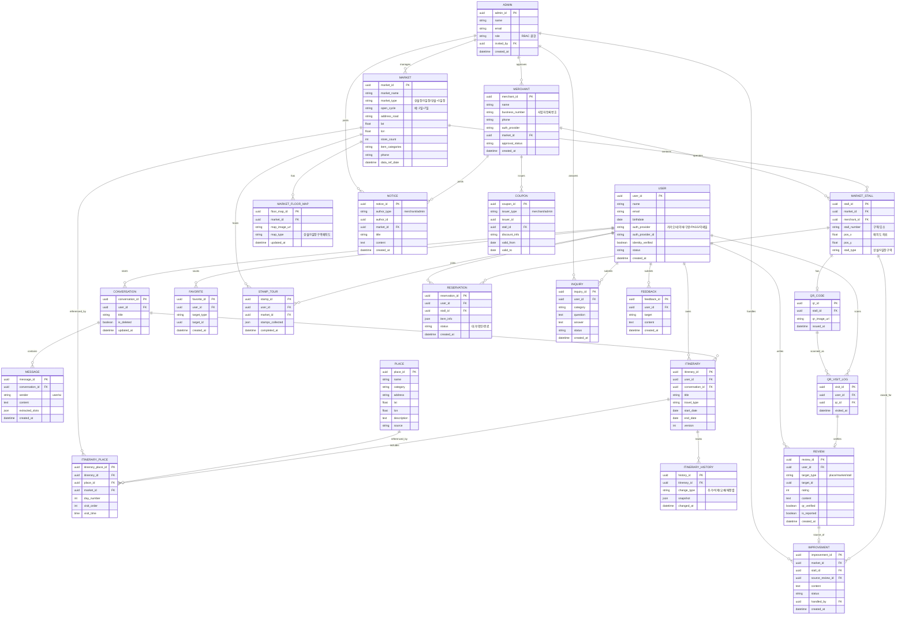

# AI기반 지역관광 맞춤 여행 플래너 - ERD (v1.0)

> 56개 FR(기능요구사항) 기준으로 설계한 데이터베이스 구조도입니다.
> PRD 5.기능요구사항 시트와 1:1로 대응됩니다.

## 테이블 목록 (총 20개)

| # | 테이블명 | 설명 | 관련 FR |
|---|---|---|---|
| 1 | USER | 일반 사용자 계정 | FR-001~007 |
| 2 | MERCHANT | 상인 계정 | FR-008,009 |
| 3 | ADMIN | 관리자 계정 | FR-010,011,050 |
| 4 | CONVERSATION | 대화 세션 | FR-018~022 |
| 5 | MESSAGE | 대화 메시지(멀티턴) | FR-021 |
| 6 | ITINERARY | 저장된 여행 코스 | FR-013,027~034 |
| 7 | ITINERARY_PLACE | 코스에 포함된 장소(순서) | FR-030~033 |
| 8 | ITINERARY_HISTORY | 일정 변경 이력(되돌리기) | FR-034 |
| 9 | PLACE | 일반 관광지/맛집/카페 | FR-023,024 |
| 10 | MARKET | 전통시장(상설/5일장) | FR-015,060,066 |
| 11 | MARKET_STALL | 시장 내 상인 매장/구역 | FR-074,077 |
| 12 | MARKET_FLOOR_MAP | 시장 배치도(플로어맵) | FR-073,075,078 |
| 13 | QR_CODE | 매장 QR코드 | FR-041 |
| 14 | QR_VISIT_LOG | QR 방문 인증 기록 | FR-042 |
| 15 | REVIEW | 리뷰(QR인증 리뷰 포함) | FR-038~040,043 |
| 16 | FAVORITE | 즐겨찾기(찜) | FR-059 |
| 17 | STAMP_TOUR | AI 스탬프 투어 | FR-070,071 |
| 18 | NOTICE | 공지사항(상인/관리자) | FR-049,061 |
| 19 | COUPON | 할인/이벤트/쿠폰 | FR-057,058,072 |
| 20 | RESERVATION | 예약주문 | FR-063,064 |
| 21 | IMPROVEMENT | QR리뷰 기반 개선사항 | FR-044~047 |
| 22 | INQUIRY | 고객문의/FAQ | FR-062 |
| 23 | FEEDBACK | 사용자 피드백 | FR-056 |

## Mermaid ERD 소스

## 설계 시 핵심 포인트 (쉬운 설명)

1. **MARKET(전통시장)이 중심 허브** — 지난번에 다운받은 "전국전통시장표준데이터"가 그대로 이 테이블의 원본 데이터가 됩니다. `market_type`, `open_cycle` 컬럼으로 5일장 여부/날짜 패턴을 판별해요.

2. **MARKET_STALL(개별 점포)** — 상인이 회원가입할 때 `merchant_id`가 생기고, 그 상인이 어느 시장의 어느 자리를 쓰는지 이 테이블이 연결해요. 지난번 좌표 매칭 작업(상가업소 CSV ↔ 전통시장)이 이 테이블을 처음 채우는 데 쓰일 수 있어요.

3. **QR 인증 흐름**: `MARKET_STALL → QR_CODE → QR_VISIT_LOG → REVIEW`
   상인이 QR을 발급 → 사용자가 스캔(방문인증) → 인증된 리뷰 작성. `review.qr_verified`로 "진짜 방문 리뷰"인지 구분해요.

4. **일정관리 되돌리기**: `ITINERARY_HISTORY`가 매 변경마다 스냅샷을 저장해서 FR-034(되돌리기)를 지원해요.

5. **사업자등록번호**: `MERCHANT.business_number`는 공공데이터에 없으니 상인 회원가입 시 직접 입력받는 컬럼이에요 (지난 대화에서 확인한 내용).

## 2주 MVP 관점에서 참고

전체 22개 테이블 중 **QR 인증 루프(사용자↔상인↔관리자 순환)**가 이 프로젝트의 핵심 차별화 포인트이므로, 아래 8개 테이블이 최우선 구현 대상입니다:
`USER, MARKET, MARKET_STALL, MERCHANT, QR_CODE, QR_VISIT_LOG, REVIEW, IMPROVEMENT`

나머지(쿠폰, 스탬프투어, 예약주문 등)는 MoSCoW에서 Should/Could로 이미 분류되어 있으니, 그 우선순위를 그대로 따라가면 됩니다.
